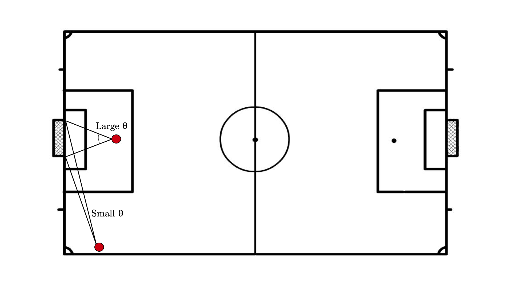
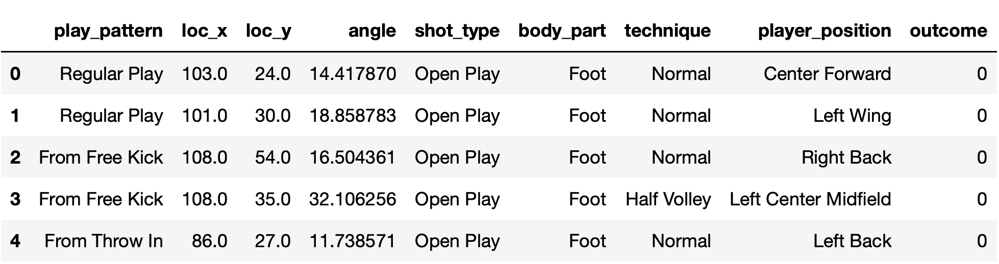

In this article, we're going to be creating an Expected Goals (xG) model using data made freely available by [Statsbomb](https://statsbomb.com/resource-centre/). As well as covering what expected goals is and the simple maths involved, we'll write some code to create an xG model and see how it performs on real matches.


### What is Expected Goals?

Put simply, expected goals is a measure of how many goals a team should have scored in a match, based on how many shots they took, and how likely those shots were to result in goals. To calculate xG then, we need to work out the expected value of each shot taken at goal in a match by a team, and sum these up. But what is the expected value of a shot? In general, expected values are calculated by first enumerating all the possible outcomes of an event. Each outcome is then multiplied by the probability of it occurring, and all of these values are summed to get the expected value. In the case of a shot at goal, the outcomes are:

$$
\textrm{No Goal}:0
$$

$$
\textrm{Goal}:1
$$

since the value of a shot at goal is 1 if scored (as this outcome increases the teams score by 1), and 0 otherwise. Thus, if we represent these two outcomes Goal and No Goal as 0 and 1 respectively, then the expected value of a single shot can be calculated as 


$$
    E[X] = \sum_{x \in \{0, 1\}} xp(X = x)
$$

$$
    E[X] = 0 \times p({X = 0}) + 1 \times p(X = 1)
$$

$$
    E[X] = 0 \times p({\textrm{X = No Goal}}) + 1 \times p(\textrm{X = Goal})
$$


where $p({X = 0})$ and $p({X = 1})$ are the probabilities of the shot resulting in no goal and a goal respectively. Since the outcome value for the event $\textrm{No Goal}$ is zero, we can remove that term, and the equation becomes

$$
E[X] = p(\textrm{X = Goal})
$$

So it's clear now that 
**<center>the expected value of a shot on goal is the probability of that shot resulting in a goal</center>**

Statsbomb's data tells us whether a shot resulted in a goal or not, so in order to calculate a team's expected goals in a single match, all we need to do is look at a teams' shots on goal in a match, calculate the probabilities of those shots going in, and sum them. 

$$
\textrm{xG} = \sum_{s \in \textrm{shots}} p(X_s = \textrm{Goal})
$$


At this point, you're probably thinking "how on earth do you calculate the probability of each shot resulting in a goal?". Enter logistic regression.

### Probabilities of Goals

At a high level, we will learn from thousands of previous examples which shots are likely to go in, based on several features of those shots. These include the x-y coordinates of the player as they took the shot, the type of play that resulted in the shot, the position that the shooting player plays in, and many more. Using these variables as inputs, and the outcome of each shot as the target variable, we can create a simple logistic regression model that outputs the probabilities of shots resulting in goals. Logistic regression looks something like this


$$
p(\textrm{Goal}) = \frac{1}{1 + e^{-(\beta_0 + \beta_1x_1 + \beta_2x_2 ... \beta_n x_n)}}
$$


where $x_i$ are the features mentioned above, and $\beta_i$ are the coefficients we will learn by fitting our model to the data. Fortunately, sklearn makes this process painless and easy, as we will see in the code. 

In a match, many factors can affect the probability of a shot finding the back of the net. To get our model to perform as well as possible, we want to use as much useful information as we can about each shot. Here is a list of the features we'll use:

* **Play Pattern**: what type of play resulted in the shot (regular play, a counter attack, a free kick etc).
* **x-Loc**: x-coordinate of the player as they took the shot.
* **y-Loc**: y-coordinate of the player as they took the shot.
* **Angle**: angle between the ball and the goal posts.
* **Shot Type**: whether the shot was from open play, a free kick, a corner etc.
* **Body Part**: which body part the was shot taken with (foot, head or other).
* **Technique**: normal shot, volley, etc.
* **Player Position**: the position played by the player who took the shot.

### One Feature to Rule Them All

Of all the features used, there is one that stands out in terms of predicting the outcome of a shot on goal. That is, the angle between the ball and the two goal posts. Intuitively, this makes sense: if the player is close to the goal as he/she shoots, or they are directly facing the centre of the goal (or both), they are more likely to score, since they are closer and have more of the goal to aim at. In this case, the angle will be large, and thus they have a higher chance of scoring. If the player is far from the goal or they are close to the corner flag, the angle will be much smaller, as will their chance of scoring. This angle should therefore give us a strong indicator of the likelihood of scoring, and using it as one of our features in the model shows exactly that.


<!--  -->
<center>
<p>
    
</p>
</center>


How do we calculate this angle? Well the Statsbomb events data gives us the x-y location of where the shot was taken from. Their data specification also tells us the coordinates of the goal posts. We can therefore calculate the distance from the ball to each goal post, as well as the distance between the two goal posts using

$$
d = \sqrt{(x_{ball} - x_{goalpost})^2 + (y_{ball} - y_{goalpost})^2}
$$


With these three distances in hand, the angle between the ball and the goal posts can finally be calculated using:

$$
\theta = \cos^{-1}(\frac{d_{1}^{2} + d_{2}^{2} - d_{3}^{2}}{2d_1d_2})
$$


There's a slight problem. Statsbomb doesn't tell us which goal the shot was taken towards. To deal with this, we can calculate the angles between the ball and both goals. Since the player taking the shot is likely going to be further away from their own goal, compared the goal they are shooting at (we're going to assume that shots are taken only in the oppositions half), the angle is in almost all cases going to be larger for the goal they are aiming towards. We simply calculate the angle from both goals, and use the largest one. Now we can use this as one of the input features to our logistic regression model, along with the others, to calculate an expected value for each shot on goal.

### How Does the Model Perform

Before diving into the code, let's have a look at the results. Below is a sample of matches for which xG has been calculated using our model, and compared to the true final score. In general, the model performs well, since the expected number of goals tends to come close to the observed score.

```JSON
{'Morocco': {'score': 1, 'xG': 0.7037000000000001},
 'Spain': {'score': 3, 'xG': 2.788499999999999}}


{'Barcelona': {'score': 2, 'xG': 2.2584}, 
 'Levante': {'score': 1, 'xG': 0.6534}}


{'Barcelona': {'score': 2, 'xG': 2.7747},
 'Racing Santander': {'score': 0, 'xG': 0.9185}}


{'Birmingham City WFC': {'score': 0, 'xG': 0.14250000000000002},
 'Chelsea FCW': {'score': 0, 'xG': 2.5339}}


{'Argentina Women's': {'score': 0, 'xG': 0.37460000000000004},
 'Japan Women's': {'score': 0, 'xG': 0.6176}}


{'Barcelona': {'score': 0, 'xG': 1.1437},
 'Villarreal': {'score': 0, 'xG': 0.31020000000000003}}


{'Atlético Madrid': {'score': 1, 'xG': 0.8788999999999999},
 'Barcelona': {'score': 6, 'xG': 2.2236000000000002}}


{'England': {'score': 2, 'xG': 2.2647999999999997},
 'Tunisia': {'score': 1, 'xG': 0.9647999999999999}}


{'Portland Thorns': {'score': 0, 'xG': 1.2822},
 'Seattle Reign': {'score': 1, 'xG': 2.2808}}


{'Barcelona': {'score': 6, 'xG': 3.2030999999999996},
 'Málaga': {'score': 0, 'xG': 0.904}}


{'China PR Women's': {'score': 1, 'xG': 1.3659000000000001},
 'South Africa Women's': {'score': 0, 'xG': 0.3744}}


{'Chelsea FCW': {'score': 3, 'xG': 3.0930999999999997},
 'Manchester City WFC': {'score': 1, 'xG': 1.8133999999999997}}


{'Sky Blue FC': {'score': 1, 'xG': 0.8275999999999999},
 'Utah Royals': {'score': 1, 'xG': 0.7798}}


{'Netherlands Women's': {'score': 1, 'xG': 1.6501},
 'Sweden Women's': {'score': 0, 'xG': 0.8777}}
```

However, let's also take a look at one of the shortcomings of the model and address how it might be improved. Consider this game between Barca and Sevilla:

<!--  -->

```JSON
{'Barcelona': {'score': 4, 'xG': 1.4849}, 
 'Sevilla': {'score': 1, 'xG': 1.5615}}

```


Sevilla's final goal tally was represented relatively well by it's expected goals. Some might say they were slightly unlucky not to have scored another. Barcelona on the other hand, significantly outperformed it's xG, scoring 2.5 more goals than expected. You could potentially explain this by saying Barcelona got lucky - they just happened to score a few more goals than expected. A more plausible explaination, and one that highlights one of the key shortcoming's of this specific xG model, is that it is player agnostic. The model has no idea that Messi and Suarez are the ones taking the shots in Barcelona's case. Players of this calibre are more likely to score under the same conditions than most players, and the model doesn't know this. Instead, every shot taken is evaluated, as if the average player which resulted in the optimal model coefficients for our training data, is taking the shot. If we had the data to do so, we could potentially calculate a 'quality metric' for each player, and use this as an additional input feature to our model. This is likely to improve the model significantly.

<!-- Now let's look at a case where a team outperformed their xG due to what was most likely good fortune. -->

### Cooooode!

If you want to create an xG model, go ahead and first download the data from [Statsbomb's Resource Centre](https://statsbomb.com/resource-centre/) if you haven't already. Here are the libraries we will be using:

``` python
import os
import json
import numpy as np
import pandas as pd
from pandas.api import types as pandas_types

from sklearn.pipeline import TransformerMixin
from sklearn.preprocessing import StandardScaler
from sklearn.linear_model import LogisticRegression
from sklearn.model_selection import train_test_split
```

#### Data Preprocessing

 Before we begin, let's take a look at the format of the match event data that we'll be dealing with. Here's a shot taken by Arsenal WFC's Leonie Maier.

 ```JSON
{'id': '0c9c9821-ebdf-47dd-8dc6-0e0f0bb081d5',
 'index': 1374,
 'period': 1,
 'timestamp': '00:31:04.178',
 'minute': 31,
 'second': 4,
 'type': {'id': 16, 'name': 'Shot'},
 'possession': 61,
 'possession_team': {'id': 968, 'name': 'Arsenal WFC'},
 'play_pattern': {'id': 4, 'name': 'From Throw In'},
 'team': {'id': 968, 'name': 'Arsenal WFC'},
 'player': {'id': 10380, 'name': 'Leonie Maier'},
 'position': {'id': 2, 'name': 'Right Back'},
 'location': [108.7, 39.2],
 'duration': 0.682287,
 'related_events': ['4deda515-533b-4af3-aa37-e04878b36a2d'],
 'shot': {'statsbomb_xg': 0.5088626,
  'end_location': [120.0, 56.7, 0.0],
  'key_pass_id': 'f65a17bb-c6ac-4e6f-9284-b914806989c9',
  'outcome': {'id': 98, 'name': 'Off T'},
  'type': {'id': 87, 'name': 'Open Play'},
  'body_part': {'id': 40, 'name': 'Right Foot'},
  'technique': {'id': 93, 'name': 'Normal'},
  'first_time': True,
  ...}
 ```
 
 
 We need to write the functions necessary for computing the input features to our model from the data. Firstly, the ```compute_angle``` function, which takes as input the x-y location of the player as they took the shot. This function calculates for each goal, the three distances mentioned previously, and computes the angles. The output is the largest of these angles.

``` python
def compute_angle(loc):
    goal_1 = np.array([[0, 36], 
                      [0, 44]])
    goal_2 = np.array([[120, 36], 
                      [120, 44]])
    
    goals = [goal_1, goal_2]
    angles = []
    
    for goal in goals:
        d1 = np.sqrt((goal[0][0] - loc[0])**2 + (goal[0][1] - loc[1])**2)  # distance from goal post 1
        d2 = np.sqrt((goal[1][0] - loc[0])**2 + (goal[1][1] - loc[1])**2)  # distance from goal post 2
        goal_length = np.abs(goal[1][1] - goal[0][1]) 
        cos_theta = (d1**2 + d2**2 - goal_length**2) / (2 * d1 * d2)  # cosine rule
        angle = np.arccos(cos_theta) * 180 / np.pi
        angles.append(angle)
        
    return np.max(angles)

```

Now we need a function that takes as input each match event, and computes all features that we will use as input to the model. In the ```body_part``` feature, ```'Right Foot'``` and ```'Left Foot'``` are originally two distinct outcomes. Since we have no way of knowing which is the strong foot of the player taking the shot, we merge the two into a single outcome: ```'Foot'```.

``` python
def compute_features(event):
        
    play_pattern = event['play_pattern']['name']
    loc = np.array(event['location'], dtype=float)
    loc_x = loc[0]
    loc_y = loc[1]
    angle = compute_angle(loc)
    shot_type = event['shot']['type']['name']
    body_part = event['shot']['body_part']['name']
    body_part = 'Foot' if body_part in ['Right Foot', 'Left Foot'] else body_part
    technique = event['shot']['technique']['name']
    player_position = event['position']['name']
    outcome = 1 if event['shot']['outcome']['name'] == 'Goal' else 0

    feature_vector = [play_pattern, loc_x, loc_y, angle, shot_type, 
                      body_part, technique, player_position, outcome]
    return feature_vector
```

Now that we have the function required to compute our inputs, let's loop through the JSON files provided by Statsbomb and calculate our features. We loop through all but the last 20 matches, saving these for model validation later. Once we have our features, we construct a pandas DataFrame.

``` python
base_path = 'open-data/data/events/'

features = []

for file_path in os.listdir(base_path)[:-20]:
    with open(base_path + file_path) as f:
        data = json.load(f)
    for i in range(len(data)):
        event = data[i]
        if 'position' in event:
            if (event['type']['name'] == 'Shot'):
                feature_vector = compute_features(event)

col_names = ['play_pattern', 'loc_x', 'loc_y', 'angle', 'shot_type', 'body_part', 'technique', 'player_position', 'outcome']
df = pd.DataFrame(features, columns=col_names).dropna()
df.head()
```
<!--  -->

<p>
    
</p>

Since there is no way to input strings into a logistic regression model, let's transform all of our categorical features (``` 'play_pattern', 'shot_type', 'body_part', 'technique', 'player_position'```), such that each value of each feature has it's own column, with binary values. Crucially, we want to be able to remember this transformation, so that we can perform it on unseen data when we are testing or evaluating our model subsequent to training. We'll make use of pandas' ```get_dummies()``` function, but write a class which saves the state of the transformation on the training data.

``` python

class DummyEncoder(TransformerMixin):

    def __init__(self):
        self.categories = None

    def transform(self, X, y=None, **kwargs):
        for cat in list(self.categories.keys()):
            X[cat] = X[cat].astype(pandas_types.CategoricalDtype(categories=self.categories[cat]))
        return pd.get_dummies(X)

    def fit(self, X, y=None, **kwargs):
        categorical_features = [x for x in df.columns if df[x].dtype==object]
        categories = [sorted(X[x].value_counts(dropna=True).index) for x in categorical_features]
        self.categories = dict(zip(categorical_features, categories))
        return self

```
Let's fit the encoder to our training data and transform it.

``` python
dummy_encoder = DummyEncoder()
dummy_encoder.fit(df)
df = dummy_encoder.transform(df)
df.head()
```
<p>
    
</p>


Finally we need to scale each variable, such that all the features are within the same range and split our training data into train and validation subsets.

```python
scaler = StandardScaler()
x_train, x_val, y_train, y_val = train_test_split(df.drop(['outcome'], axis=1), df['outcome'], 
                                                  train_size=0.8, stratify=df['outcome'])
x_train = scaler.fit_transform(x_train)
x_val = scaler.transform(x_val)
```

#### Defining and Training Our xG Model

Fitting our model to the data is as simple as 

```python
xG_model = LogisticRegression(solver='liblinear', max_iter=2000)
xG_model.fit(x_train, y_train)
```

#### Evaluation

Now that the model is trained, let's predict the probabilities of the shots in our validation set, and evaluate the performance of the model.

```python
y_pred = xG_model.predict_proba(x_val)[:, 1]

auc = roc_auc_score(y_val, y_pred)
fpr, tpr, threshold = roc_curve(y_val, y_pred, )

plt.title('ROC Curve')
plt.plot(fpr, tpr, 'k', label='AUC: {0:.2f}'.format(auc), alpha=0.7)
plt.legend(loc = 'upper left', fontsize=12, frameon=False, handlelength=0)
plt.plot([0, 1], [0, 1],'r--', alpha=0.4)
plt.xlim([0, 1])
plt.ylim([0, 1])
plt.ylabel('True Positive Rate', fontsize=12)
plt.xlabel('False Positive Rate', fontsize=12)
plt.show()
```

<p>
    
</p>

An AUC score of 0.8 - respectable for any classification task.

### Conclusion

There you have it - we defined what expected goals is, and created a simple model using freely available data. Here are some key takeways:

<!-- While we focused on the xG of a team, the expected value of a shot can also used to evaluate the quality of individual shots, serving as an evaluation metric for the quality of strikers. -->

* Expected Goals can be used to evaluate the performance of a team during match. When xG comes close to the score of a team, this indicates that they performed as we would have expected them to perform. When a team outperforms their xG, this means they scored more goals than expected, either due to an exceptional performance, or simply good luck. On the other hand, if a team scores fewer goals than their xG, this indicates that they perfomed poorly, failing to put away chances that they otherwise should have.
* Expected Goals can also be used to assess the quality of individual shots, serving as an evaluation metric for the performance of strikers.

Thanks for reading. If want to play around with the code yourself, [here](https://github.com/by256/xG) is a link to the repository.

Follow me on twitter [@batuhanyil](https://twitter.com/batuhanyil).
