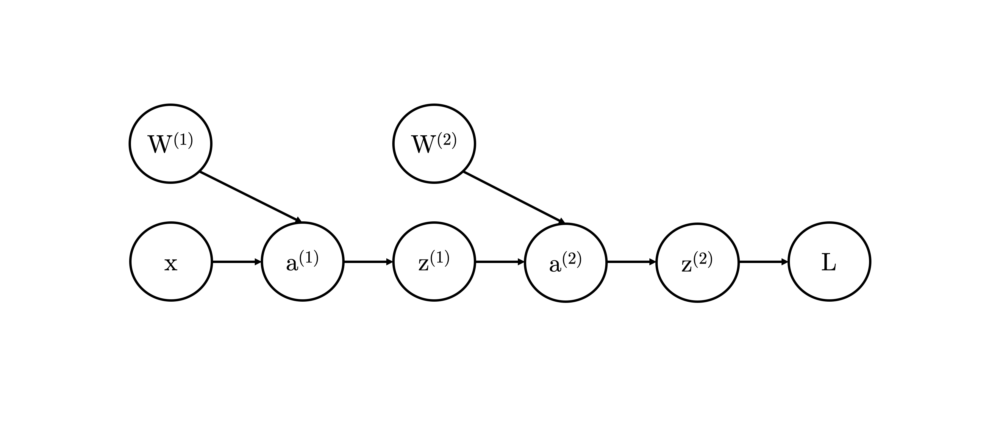

### Backpropagation

In order to update the weights of a neural network using some form of stochastic gradient descent (SGD), we must compute the partial derivatives of the loss with respect to the parameters of the model. By doing so, we can take a step in parameter space in a direction that minimises the loss of our model.

Consider a simple neural network, where we perform two sets of the following operations: a linear transformation ($a^{(l)} = W^{(l)}x$ in the first layer and $a^{(l)} = W^{(l)}z^{(l)}$ in all following layers), followed by some arbitrary differentiable non-linear transformation $z^{(l)}(a)$. We then use the output of this composite function to compute a differentiable loss $L$. This series of operations can be unrolled and represented as a graphical model:

<!--  -->

    

Our goal is to compute $\frac{\partial L}{\partial W^{(2)}}$ and $\frac{\partial L}{\partial W^{(1)}}$. We do so by first following the path backwards from $L$ to $W^{(2)}$ in the graphical model, and multiplying the partial derivatives as we go from node to node. Thus we first compute $\frac{\partial L}{\partial W^{(2)}}$ using the chain rule as follows:

$$\frac{\partial L}{\partial W^{(2)}} = \frac{\partial L}{\partial z^{(2)}} \frac{\partial z^{(2)}}{\partial a^{(2)}} \frac{\partial a^{(2)}}{\partial W^{(2)}}$$

If we break this apart, we can see that $\frac{\partial L}{\partial z^{(2)}}$ is the derivative of the loss with respect to its input, and similarly, $\frac{\partial z^{(2)}}{\partial a^{(2)}}$ is the derivative of the non-linear activation with respect to its input. Both have closed-form solutions - with the latter depending on the choice of activation function - and can be computed with no trouble. Regarding the third term, it is evident that the derivative of the linear transformation with respect to the weights of the second layer $\frac{\partial a^{(2)}}{\partial W^{(2)}}$ is simply $z^{(2)}$. If we denote $\frac{\partial z^{(2)}}{\partial a^{(2)}} \frac{\partial a^{(2)}}{\partial W^{(2)}}=\delta^{(2)}$, the resulting partial derivative can therefore be expressed as 

$$\frac{\partial L}{\partial W^{(2)}} = \delta^{(2)} z^{(2)}$$

Similarly, to compute $\frac{\partial L}{\partial W^{(1)}}$, we continue unrolling the partial derivatives of our composite function using the chain rule. We have already computed  $\frac{\partial L}{\partial a^{(2)}} = \delta^{(2)}$, therefore

$$\frac{\partial L}{\partial W^{(1)}} = \delta^{(2)} \frac{\partial a^{(2)}}{\partial z^{(1)}} \frac{\partial z^{(1)}}{\partial a^{(1)}} \frac{\partial a^{(1)}}{\partial W^{(1)}}$$

Denote that $\delta^{(2)} \frac{\partial a^{(2)}}{\partial z^{(1)}} \frac{\partial z^{(1)}}{\partial a^{(1)}} = \delta^{(1)}$. Similar to before, $\frac{\partial a^{(1)}}{\partial W^{(1)}}$ is simply equal to $x$, so 

$$\frac{\partial L}{\partial W^{(1)}} = \delta^{(1)} x$$

With that, the partial derivates of the loss with respect to the weights of each layer of the neural network can be computed, and the weights can be updated by gradient descent. 